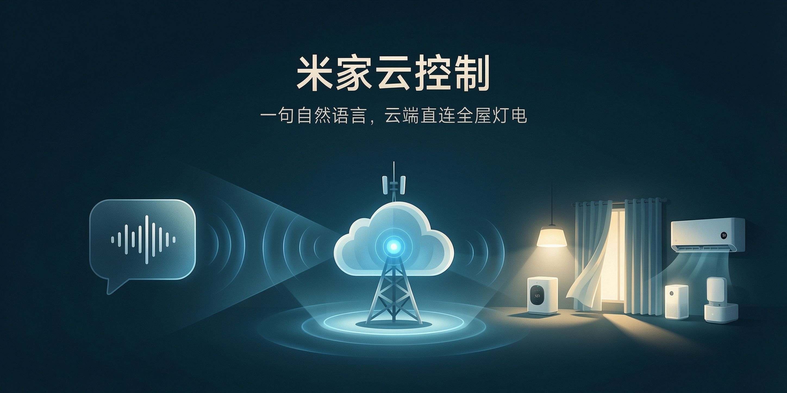

<div align="center">

# 米家云控制

**一句自然语言控制全屋米家设备——不依赖 Home Assistant、不刷固件，走小米云 API 直连。**


[它解决什么问题](#它解决什么问题) - [为什么比手动强](#为什么比手动强) - [工作流](#工作流) - [实测参数](#实测参数) - [快速开始](#快速开始)

</div>

---

## 它解决什么问题

想用自然语言控制全屋米家灯、空调、窗帘，但小米已封死 OAuth2 password grant，直接拿账号密码 API 登录走不通。现成方案 Home Assistant 要额外硬件和维护成本。需要一套零额外硬件、复用现有米家账号的云 API 直连方法：先打通登录，再拉设备清单、查状态、下发控制，甚至做音乐律动灯效。

## 为什么比手动强

| 手动控制 | 本仓库 |
|---|---|
| 逐个 App 点开控制 | 一句自然语言 → 云端 API 串行下发 |
| 想拿账号密码直接 API 登录 | 走网页登录 + 短信验证码 + 已验证 deviceId |
| 灯具控制乱试 siid | MIoT 设备走 miotspec 端点，先 prop/get 探有效 siid |
| 控制凭感觉、误开误关 | 控制前先读原状态，结束后 try/finally 恢复 |
| 多套房设备分不清归属 | 按网段/网关分房，只读/可操作边界明确 |

## 工作流

```
登录（网页登录 + 短信验证码 + 已验证 deviceId，token 30天有效）
   ↓
拉设备清单（81 台，含 did/model/在线状态）
   ↓
控制前先查在线状态与归属
   ↓
串行下发（传统插座走 miio_rpc；MIoT 灯具走 miotspec/prop/get|set）
   ↓
结束后恢复原状态（try/finally 兜底）
```

## 实测参数

- **设备规模**：2026-08-19 全链路打通，设备清单 81 台
- **登录现状**：小米已封死 OAuth2 password grant，必须网页登录 + 短信验证码 + deviceId
- **云端延迟**：单次云端调用 110-180ms，禁止并发（单账号并发敏感）
- **灯具控制坑**：MIoT 灯具 miio_rpc 报 `undefined command`，必须走 `/miotspec/prop/get|set`；非标准 siid（如晾衣架灯在 siid=3）要先遍历探测
- **参考与脚本**：`references/` 4 篇 + `scripts/rhythm_flash.py`、`analyze_light_video.py`（视频逐帧测光）

## 快速开始

```python
import sys; sys.path.insert(0, "/opt/data/skills/@clawhub_lanlan314/xiaomi-miot-lan")
from mijia_api import MijiaCloud
mc = MijiaCloud()
devs = mc.device_list()                          # 全部设备
mc.miio_rpc(did, "get_prop", ["power"])          # 查开关状态
mc.miio_rpc(did, "set_power", ["on"])            # 传统插座开
# MIoT 灯具：mc.api('/miotspec/prop/set', {'params':[{'did':DID,'siid':2,'piid':1,'value':True}]})
```

## 设计取舍

- **为什么不用 HA**：HA 边缘网关更稳但要额外硬件与维护；本方案零硬件、复用现有账号
- **为什么不并发**：云端对单账号并发敏感，串行避免限流与顺序错乱
- **公开版已脱敏**：移除真实 DID、内网 IP、小区/WiFi 名与账号信息

## License

MIT
